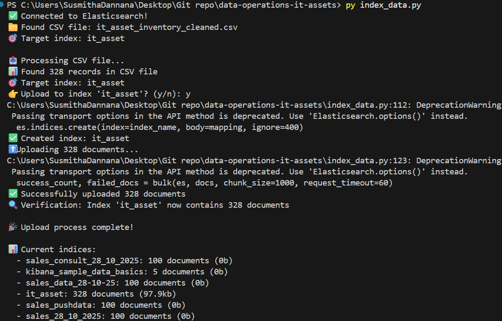
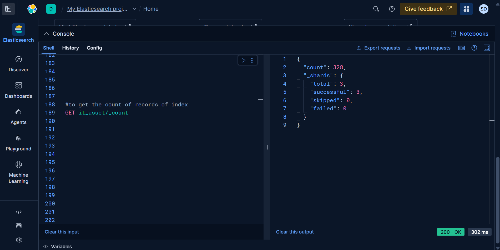
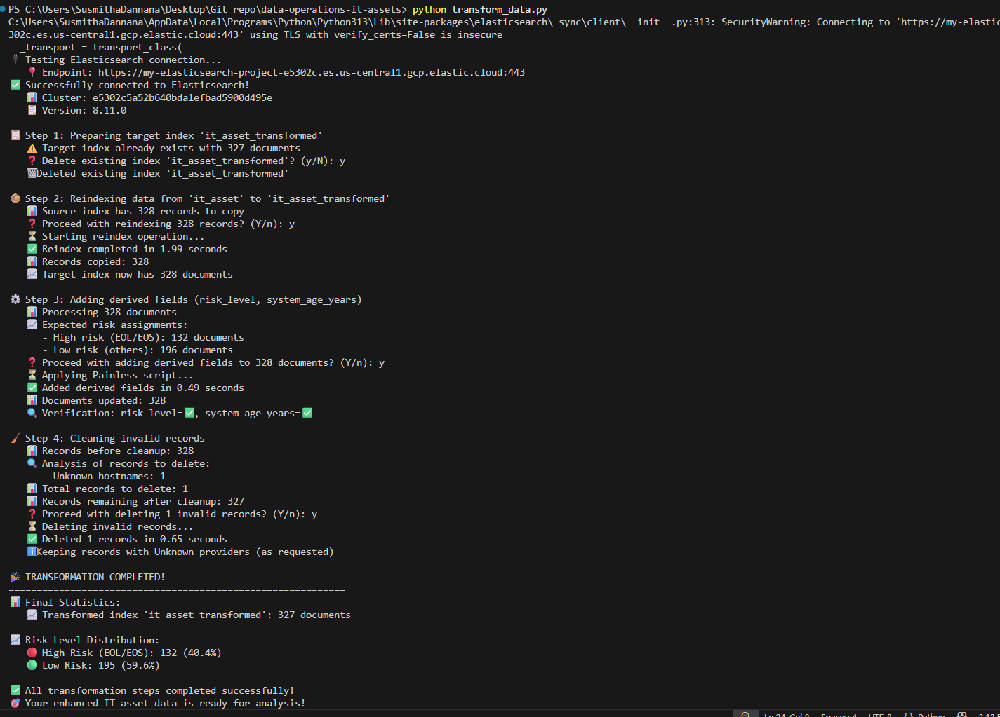

# IT Asset Data Operations & Insights

**Mini Project: End-to-End Data Engineering Pipeline**

A comprehensive hands-on project demonstrating data engineering and analytics workflows — from cleaning raw data to building meaningful business insights through visualizations using Excel, Python, Elasticsearch, and Kibana.

## 🚀 Project Overview

This mini-project provides hands-on experience in:
- **Data Cleaning**: Excel-based data preparation and validation
- **Data Ingestion**: Python scripts for Elasticsearch indexing
- **Data Transformation**: Advanced data enrichment and derived field creation
- **Data Visualization**: Kibana dashboard development for business insights
- **Version Control**: Git workflow and documentation

**Dataset**: IT Asset Inventory (`it_asset_inventory_enriched.csv`)
**Challenge**: Working with intentionally "messy" data that simulates real-world enterprise data challenges

## 📁 Project Structure

```
data-operations-it-assets/
├── it_asset_inventory_cleaned.csv    # Cleaned source data (Phase 1)
├── index_data.py                     # Initial data import script (Phase 2)
├── transform_data.py                 # Data transformation operations (Phase 3)
├── visualization_screenshots/        # Dashboard screenshots (Phase 4)
├── README.md                         # Project documentation
└── final_report.md                   # Business insights and learnings
```

## 🎯 Project Phases

### **PHASE 1 — Excel Data Cleaning** ✅
**Objective**: Clean the dataset in Excel and prepare it for Elasticsearch ingestion

**Tasks Completed**:
- ✅ Removed duplicate rows based on `hostname` field using Data → Remove Duplicates
- ✅ Trimmed extra spaces from text fields using `=TRIM()` function
- ✅ Handled missing values by replacing empty cells with "Unknown"
- ✅ Standardized date format in `operating_system_installation_date` to YYYY-MM-DD
- ✅ Saved cleaned data as `it_asset_inventory_cleaned.csv`

### **PHASE 2 — Indexing Data to Elasticsearch** ✅
**Objective**: Load cleaned CSV data into Elasticsearch using Python

**Implementation**:
- ✅ Created `index_data.py` script for bulk data import
- ✅ Automatic index creation with proper field mappings
- ✅ Error handling and progress tracking during upload
- ✅ Successfully indexed data to `it_asset` index

### **PHASE 3 — Data Transformation & Enrichment** ✅
**Objective**: Enhance indexed data with derived fields and data quality improvements

**Tasks Completed**:
- ✅ **Reindexed data** to new index (`it_asset_transformed`) with transformations
- ✅ **Added risk_level field**: "High" for EOL/EOS systems, "Low" for others
- ✅ **Calculated system_age_years**: From installation date to current date
- ✅ **Data cleaning**: Removed records with missing hostnames or Unknown providers
- ✅ **Updated existing records** using `_update_by_query` API

### **PHASE 4 — Visualization and Insights** ✅
**Objective**: Build business dashboards and derive actionable insights

**Visualizations Created**:
- ✅ **Assets by Country** - Geographic distribution analysis
- ✅ **Lifecycle Status Distribution** - OS lifecycle breakdown
- ✅ **High vs Low Risk Assets** - Security risk assessment
- ✅ **Top OS Providers** - Vendor distribution analysis

### **PHASE 5 — GitHub Submission** ✅
**Objective**: Version control and comprehensive documentation

**Deliverables**:
- ✅ Complete project repository with all phases
- ✅ Detailed README with phase documentation
- ✅ Screenshots of successful operations
- ✅ Business insights and recommendations

## 🛠️ Features

### Data Import (`index_data.py`)
- ✅ Bulk import CSV data to Elasticsearch
- ✅ Automatic index creation with proper field mappings
- ✅ Error handling and progress tracking
- ✅ Data validation during import

### Data Transformation (`transform_data.py`)
- ✅ **Reindex data** to a new index with transformations
- ✅ **Risk Assessment**: Add `risk_level` field based on OS lifecycle status
- ✅ **System Age Calculation**: Calculate `system_age_years` from installation date
- ✅ **Data Cleaning**: Remove records with missing hostnames or Unknown providers
- ✅ **In-place Updates**: Update existing records using `_update_by_query`

## 📊 Data Fields

### Original Fields
| Field | Type | Description |
|-------|------|-------------|
| `hostname` | keyword | System hostname identifier |
| `country` | keyword | Geographic location |
| `operating_system_name` | text | OS name and version |
| `operating_system_provider` | keyword | OS vendor (RedHat, Microsoft, etc.) |
| `operating_system_installation_date` | date | OS installation date (YYYY-MM-DD) |
| `operating_system_lifecycle_status` | keyword | Current lifecycle status (Active, EOL, EOS, Planned) |
| `os_is_virtual` | boolean | Virtual machine flag |
| `is_internet_facing` | keyword | Internet exposure status |
| `image_purpose` | keyword | System purpose (Production, Testing, DR, etc.) |
| `os_system_id` | keyword | Unique system identifier |
| `performance_score` | float | System performance rating |

### Derived Fields (Added by Transformation)
| Field | Type | Description | Business Logic |
|-------|------|-------------|----------------|
| `risk_level` | keyword | Security risk assessment | `"High"` if lifecycle_status is "EOL" or "EOS", else `"Low"` |
| `system_age_years` | float | System age in years | Calculated from installation_date to current date |

## ⚙️ Configuration

Update the Elasticsearch connection settings in both scripts:

```python
ES_ENDPOINT = "your_endpoint_here"
ES_API_KEY = "your-api-key"
SOURCE_INDEX = "it_asset"
TARGET_INDEX = "it_asset_transformed"
```

## 🚀 Usage

### Step 1: Import Initial Data
```bash
python index_data.py
```
This creates the `it_asset` index with your CSV data.

### Step 2: Transform and Clean Data
```bash
python transform_data.py
```

**Menu Options:**
1. **Reindex data to new index** - Creates `it_asset_transformed` with all transformations
2. **Update existing records** - Adds derived fields to source index using `_update_by_query`
3. **Delete invalid records** - Removes records with missing hostnames/Unknown providers
4. **Run all operations** - Executes all transformations in sequence
5. **Exit**

## 📈 Visualizations

Kibana dashboard built on `it_asset_transformed` index:


**Dashboard includes:**
- **Assets by Country** - Geographic distribution of IT assets
- **Lifecycle Status Distribution** - OS lifecycle status breakdown
- **High vs Low Risk Assets** - Security risk assessment overview
- **Top OS Providers** - Most common operating system vendors

## 🔧 Requirements

### Python Dependencies
```bash
pip install elasticsearch
```

### Elasticsearch Requirements
- Elasticsearch 7.x or 8.x
- Valid API key with index creation and update permissions
- Network access to Elasticsearch cluster

## 📊 Data Quality Rules

### Records Excluded During Transformation:
- ❌ Missing or empty `hostname` fields
- ❌ `operating_system_provider` = "Unknown"

### Risk Level Classification:
- 🔴 **High Risk**: `operating_system_lifecycle_status` = "EOL" or "EOS"
- 🟢 **Low Risk**: All other lifecycle statuses

### System Age Calculation:
```
system_age_years = (current_date - installation_date) / 365.25
```

## 💡 Business Insights & Recommendations

### Key Findings:
- **Geographic Distribution**: Assets primarily concentrated in Unknown (filtered), USA, and India regions
- **Security Risk Assessment**: Automated classification of high-risk EOL/EOS systems enables proactive security management
- **System Age Analysis**: Calculated system age provides data-driven insights for infrastructure refresh planning
- **Data Quality**: Transformation process identified and removed invalid records, improving data reliability

### Strategic Recommendations:
- 🔒 **Security Priority**: Focus on upgrading EOL/EOS systems identified as "High Risk"
- 📅 **Maintenance Planning**: Use system age data to schedule proactive hardware/OS upgrades
- 🌍 **Regional Operations**: Optimize IT support based on geographic asset distribution
- 📊 **Data Governance**: Implement data validation rules to prevent future data quality issues

### Business Impact:
- **Risk Reduction**: Proactive identification of security vulnerabilities
- **Cost Optimization**: Data-driven planning for infrastructure investments
- **Operational Efficiency**: Automated data processing reduces manual effort
- **Compliance**: Systematic tracking of system lifecycle status

## 🔄 Data Pipeline Flow

```
PHASE 1: Excel Cleaning
it_asset_inventory_enriched.csv → [Excel Functions] → it_asset_inventory_cleaned.csv
                                      ↓
                             • Remove duplicates
                             • Trim spaces
                             • Handle missing values
                             • Standardize dates

PHASE 2: Data Indexing
it_asset_inventory_cleaned.csv → index_data.py → [it_asset] Elasticsearch Index
                                     ↓
                                • Bulk import

PHASE 3: Data Transformation
[it_asset] → transform_data.py → [it_asset_transformed]
               ↓
          • Reindex with filtering
          • Add risk_level field
          • Calculate system_age_years
          • Remove invalid records
          • Update existing records

PHASE 4: Visualization
[it_asset_transformed] → Kibana → Business Dashboards
                           ↓
                      • Assets by Country
                      • Lifecycle Distribution
                      • Risk Assessment
                      • Provider Analysis

PHASE 5: Documentation & Insights
Dashboards + Analysis → README.md + Business Recommendations
```

## 📸 Execution Results & Screenshots

### **index_data.py Execution Results**

**Terminal Output:**


**Elasticsearch Verification:**


### **transform_data.py Execution Results**

**Terminal Output:**


**Elasticsearch Verification:**


**Key Results Summary:**
- ✅ Successfully indexed original CSV data to `it_asset` index
- ✅ Applied transformations and created `it_asset_transformed` index
- ✅ Added `risk_level` and `system_age_years` derived fields
- ✅ Filtered out invalid records during transformation
- ✅ All operations completed with detailed logging

## 🏆 Expected Outcomes & Learnings

**By completing this project, demonstrated skills in**:
- ✔️ **Data Cleaning**: Excel functions for real-world messy data preparation
- ✔️ **Python Development**: Scripts for data indexing and transformation in Elasticsearch
- ✔️ **Data Engineering**: ETL pipelines with validation and error handling
- ✔️ **Version Control**: Git workflow and collaborative development practices
- ✔️ **Data Visualization**: Kibana dashboard creation for business intelligence
- ✔️ **Business Analysis**: Deriving actionable insights from technical data
