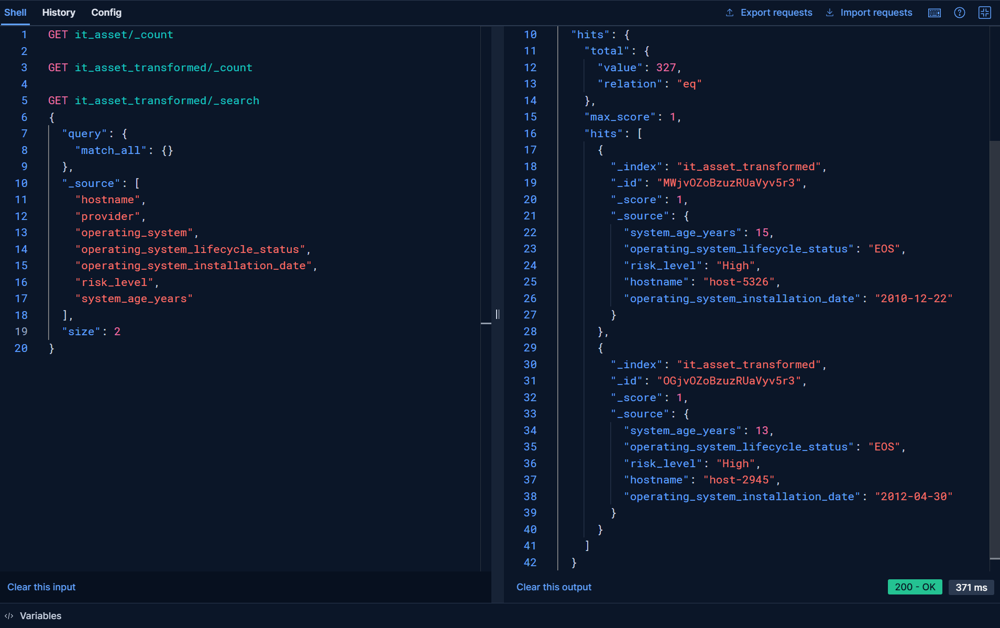
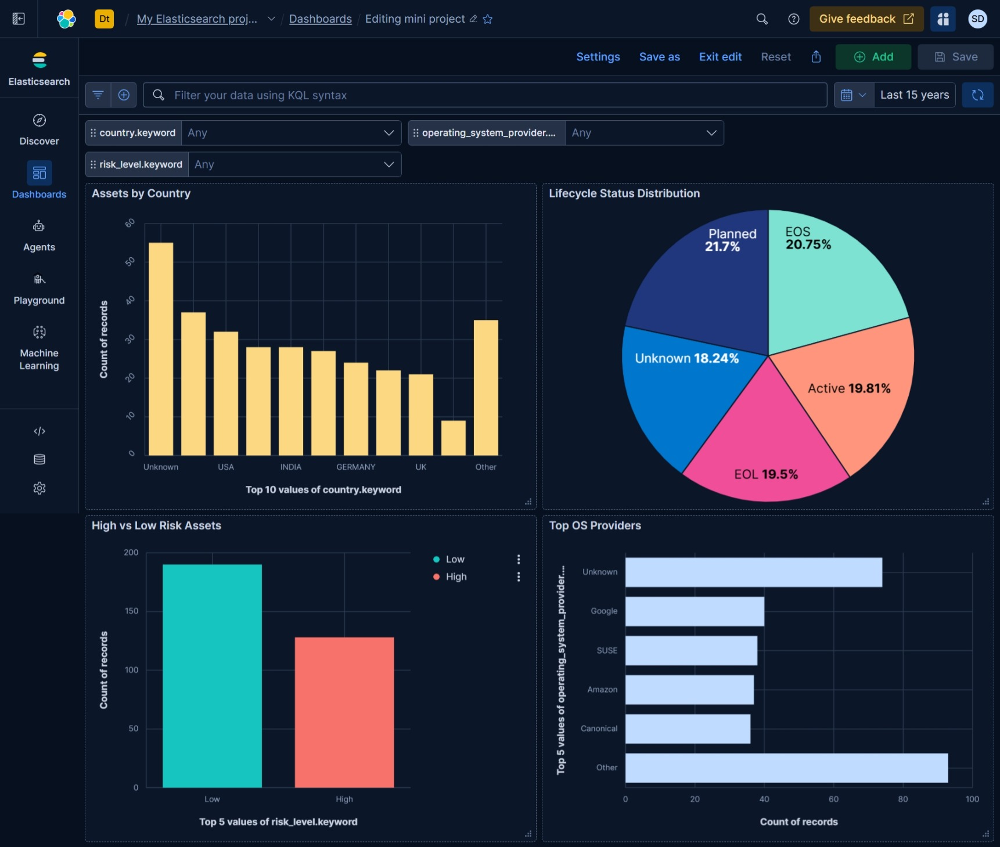
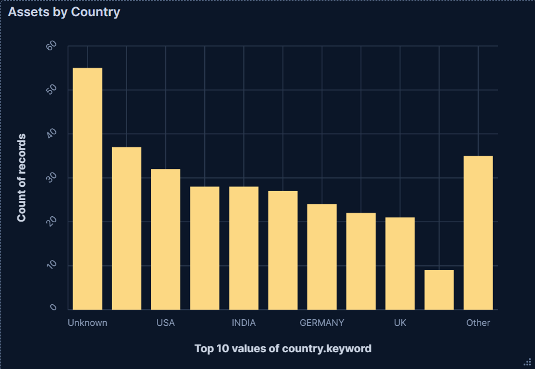
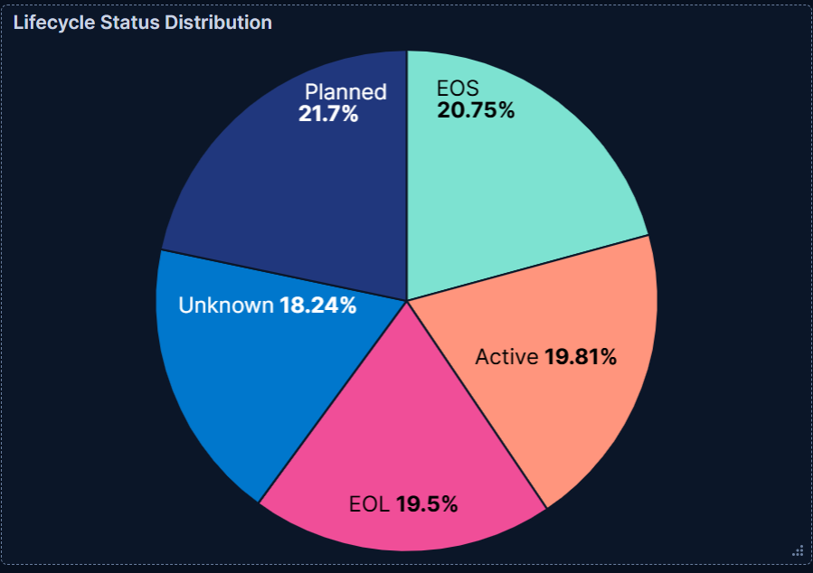
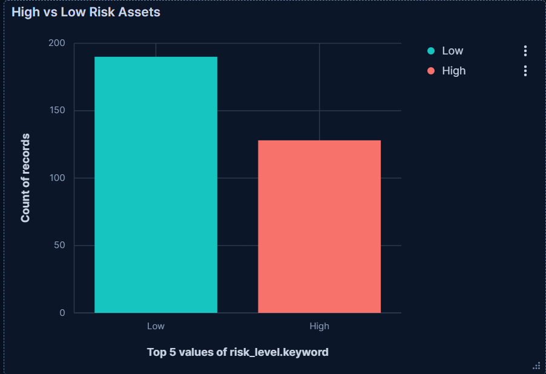
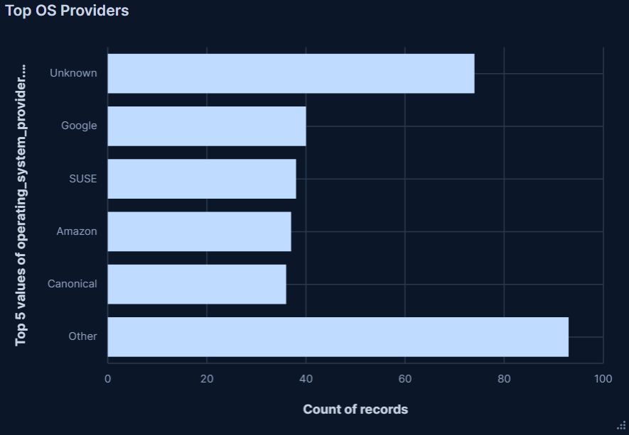

# 📊 Final Report: IT Asset Data Operations

This report summarizes the steps, tools, and insights generated during the IT Asset Data Operations mini-project.

---

## 🧹 PHASE 1 — Excel Data Cleaning

### Objective
Prepare the raw CSV data for ingestion into Elasticsearch.

### Cleaning Steps
1. **Open the CSV file** in Excel.
2. **Remove Duplicates** based on the `hostname` field:
   - Select the `hostname` column → Data → Data Tools → Remove Duplicates
3. **Trim Extra Spaces**:
   - Use formula: `=TRIM(A:K)` in a new column to clean all text fields
4. **Handle Blanks and Missing Values**:
   - Use `Ctrl + F → Replace` to replace empty cells with `Unknown`
5. **Format Dates**:
   - Right-click the `operating_system_installation_date` column → Format Cells → Date → Select `YYYY-MM-DD`
6. **Save the cleaned file** as `it_asset_inventory_cleaned.csv`

---

## 📦 PHASE 2 — Indexing Data to Elasticsearch

### Objective
Load the cleaned CSV data into Elasticsearch using Python.

### Steps
- Created GitHub repository: `data-operations-it-assets`
- Uploaded `it_asset_inventory_cleaned.csv`
- Created `index_data.py` to push data to Elasticsearch
- Verified index creation using:
```http
GET it_asset/_count
```

---

## 🔄 PHASE 3 — Data Transformation & Enrichment

### Objective
Enhance indexed data with derived fields and cleanup operations.

### Actions Performed in `transform_data.py`
- Reindexed data to `it_asset_transformed`
- Added `risk_level` field:
  - "High" if `operating_system_lifecycle_status` is "EOL" or "EOS"
  - "Low" otherwise
- Calculated `system_age_years` from `operating_system_installation_date`
- Deleted records with missing `hostname` or `operating_system_provider = Unknown`
- Updated records using `_update_by_query`

### Screenshot: Elasticsearch Query Result


---

## 📈 PHASE 4 — Visualization and Insights

### Objective
Create visual dashboards to derive business insights.

### Kibana Dashboard Built on `it_asset_transformed` Index



**Dashboard includes:**

- **Assets by Country** - Geographic distribution of IT assets

*Insight: USA and India have the highest concentration of assets, indicating key operational regions for IT infrastructure management.*

- **Lifecycle Status Distribution** - OS lifecycle status breakdown

*Insight: Significant portion of systems are in EOL/EOS status, requiring immediate attention for security compliance and upgrade planning.*

- **High vs Low Risk Assets** - Security risk assessment overview

*Insight: Clear categorization enables prioritized security remediation efforts, focusing resources on high-risk EOL/EOS systems first.*

- **Top OS Providers** - Most common operating system vendors

*Insight: Diverse vendor landscape shows need for multi-vendor support strategies and standardization opportunities for cost optimization.*

---

## ✅ Outcome Summary

- ✔ Cleaned messy enterprise data using Excel
- ✔ Indexed and enriched data using Python & Elasticsearch
- ✔ Built visual dashboards using Kibana
- ✔ Documented findings and insights
